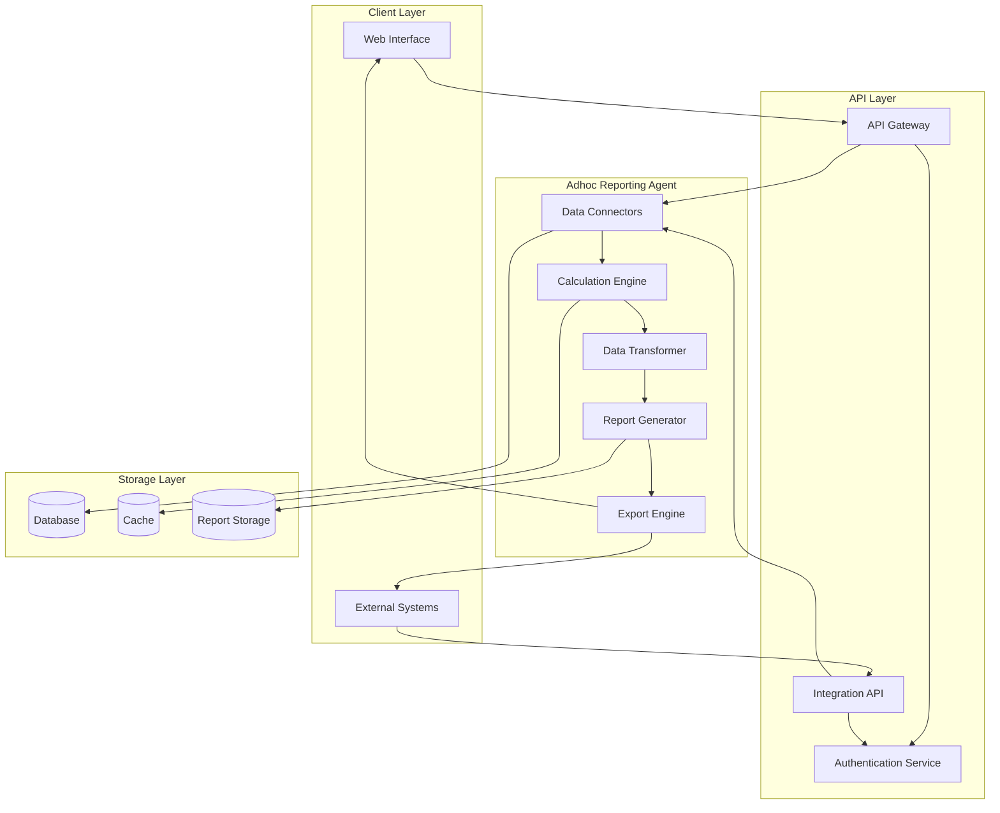

# AdhocReportingAgent
This system is designed to streamline the creation of ad-hoc reports for SaaS businesses, addressing a key need for custom reporting flexibility.

## The Problem
SaaS businesses often face the challenge of meeting customer requests for reports beyond what standard dashboards provide. This results in several pain points:

1. Engineering teams divert time to one-off reports rather than focusing on core product features.
2. Customer success teams become bottlenecks as they await custom report delivery from engineering.
3. Sales teams may lose deals when specific reporting capabilities can't be promised.
4. Product teams struggle to standardize reporting features that meet diverse, industry-specific needs.

While many SaaS platforms offer basic reporting, these often fall short in scenarios where customers require:
- Complex calculations across multiple data sources
- Industry-specific business logic
- Extensive visualization options
- Automated report generation and distribution
- Data exports in unique formats

## The Solution
AdhocReportingAgent aims to support ad-hoc reporting with flexibility and extensibility. However, the system is not a one-size-fits-all solution; it’s designed to serve as a customizable foundation that organizations can adapt to meet specific reporting needs. The goal is to reduce, though not entirely eliminate, the reliance on engineering for custom reporting support.

The system consists of three core components:
1. **Client Application**: A user-friendly web interface enabling users to connect data, create, customize, and export reports with limited technical assistance.
2. **Application Programming Interface (API)**: Supports programmatic report generation and is designed for technical users who need direct integration with external systems.
3. **Adhoc Reporting Agent Module**: This module handles core report-generation logic, including calculations, data transformations, and format conversions, though further customization may be needed for complex, industry-specific needs.

**Note**: Implementing AdhocReportingAgent still requires technical support for integration, security compliance, and performance optimization as usage scales. This system is intended to reduce bottlenecks rather than eliminate all support dependencies, offering flexibility with scalability in mind.

## Architecture Diagram

