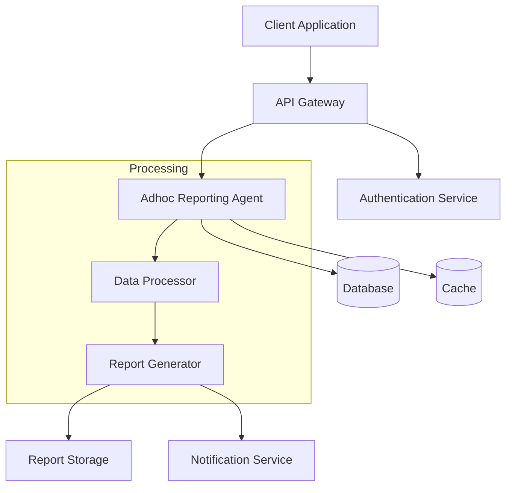

# AdhocReportingAgent

```mermaid
graph TD
    Client[Client Application] --> API[API Gateway]
    API --> Auth[Authentication Service]
    API --> Agent[Adhoc Reporting Agent]
    Agent --> DB[(Database)]
    Agent --> Cache[(Cache)]
    subgraph Processing
    Agent --> DataProcessor[Data Processor]
    DataProcessor --> ReportGenerator[Report Generator]
    end
    ReportGenerator --> Storage[Report Storage]
    ReportGenerator --> Notifier[Notification Service]
```
